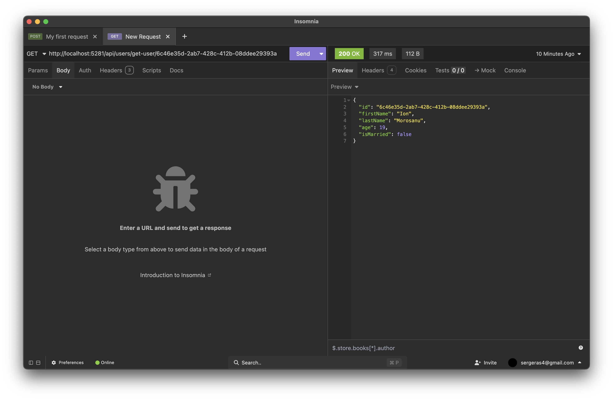
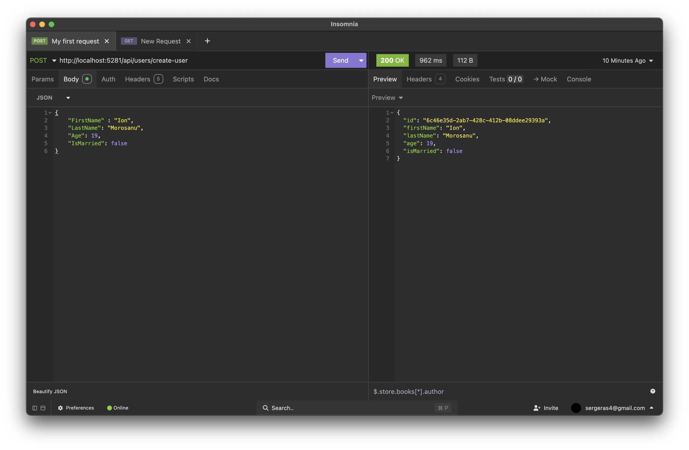

## Blazor App 

### Added: 
- [x] SQL Server connection
- [x] Entity Framework Core integration
- [x] Basic CRUD operations
- [x] A User model
- [x] Controller for handling user requests
- [x] Containerization with Docker
- [ ] Proper UI with Blazor

  
  

